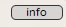
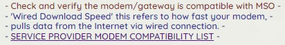

# Connectivity tool README

<!--START_SECTION:badges-->
## Develomenpt tools


<!--END_SECTION:badges-->

## Interactive flowchart in HTML/Javascript/jQuery

specify JSON file location at top of flowchart.js
var stepfile = "filename.json";

````jsvascript
var stepfile = "./src/js/start.js"; // specify JSON file location here
````

## Debug

toggle showing a step's name on mouseover by changing debug to true (enable) or false (disable)
var debug = true;

````javascript
var debug = true; //Enables showing STEPNAME when holding mouse pointer over a step
````

## Creating steps on json file

Add items to "steps" section of JSON file in following format:

All options in each step are optional, but remember to put a comma at the end of all but the last item in a step
If you get a "parsererror" or "SyntaxError", try validating the JSON file using this site,
[JSON formatter](http://jsonformatter.curiousconcept.com/). Comma must be present if there is more than one line!

### Option "Question"

A simple text string that will be displayed in a large size, depends on css class="question"

````json
"Question" : "First question that appear on the step",
````


### Option "Popmsg" and "Poplink"

"Popmsg" contains text for message box popup on click for clarification
"Poplink" opens a link in new window/tab.

"Popmsg" and "Poplink"  create an "info" button on the step.
An alternate label instead of "info" can be defined with "Popmsglabel"
Using both "Poplink" and "Popmsg" will cause the Popmsg text to be used as an OK/Cancel confirmation before opening the Poplink.
These two options REQUIRE the "Question" option to be present. This may be changed in future versions if needed.

css class="tip"

````json
"Popmsg" : "Use this tool whenever you need to troubleshoot a device with technical issues",
````

````json
"Poplink" : "https://arris.my.salesforce.com/articles/General_FAQs/ARRIS-Product-Warranty-Replacement-Guidelines",
````



### Option "Text"

An array of text between brackets, this option is for basic text or important text to clarify the step, it also supports certain HTML tags, such as links, line breaks.
This text or tag will be interpreted and drawn.

css class="text"

````json
"Text" :
[
 "<br>",
 "Array of text, inside brackets",
 "another text",
 "<a href='http://somepage.com' target = '_blank'>A link for a certain page</a>"
]
````



### Option "QuestionsTemplate"

An array template that will automatically appear in the notes if are empty.
Agent can delete that questions

````json
"QuestionsTemplate":
[
 "First question:  ",
 "Second question: "
],
````


### Option "NoNotes"

"NoNotes" : "true", omit this line entirely to include a notes section for the agent to type comments

````json
"NoNotes":"true",
````

### Option Note height

An string that can set a height property on the notes

````json
"Noteheight": "8rem", specify for custom note height,
````

Example with LED Chart handling
first item in each line is the destination step.

Following are led status in order Power, Receive, Send, Online
for LED status, "*" matches any status.

````json
"allsolid" :
{
 "Question" : "What is the LED status?",
 "LEDchart" : 
 [
  ["poweroff", "off", "off", "off", "off"],
  ["powerflash", "flashing", "*", "*", "*"],
  ["checkconnect2", "solid", "flashing", "off", "off"],
  ["sendcheckcoax", "solid", "solid", "flashing", "off"],
  ["fwreset", "solid", "flashing", "flashing", "*"],
  ["onlinesolid", "solid", "solid", "solid", "solid"],
  ["onlineoff", "solid", "solid", "solid", "*"]
 ],
 "LEDfail" : "powerflash" 
},

````

## Options on json steps

"Skips" has the flowchart remember a reset was performed at this step. If step is backtracked or the flow is started over,
the remembered reset is forgotten. You can specify as many remembered actions as needed.

(example: ["step_to_jump_to", "Performed factory reset", "action_to_remember", "action2_to_remember", "more_actions"])
Use with new option "Skips" : [["step_remembered", "step_to_skip_to"]], to specify skipping to another step instead if a reset was already done.
You can skip to different steps for different steps remembered as well, like this:

````json
"Skips" : 
[
  ["reset", "redirsignal"],
  ["power", "rma"]
],
````

"Table" creates a table in similar formatting to the "Text" option.
Use "***" to set a box as a table header.
Example:

````json
"Table" : 
[
 ["***Header 1", "***Header 2", "***Header 3"],
 ["Data 1", "Data 2", "Data 3"]
],
````

All options in each step are optional, but remember to put a comma at the end of all but the last item in a step
If you get a "parsererror" or "SyntaxError", try validating the JSON file using this site:
 [JSON formatter](http://jsonformatter.curiousconcept.com/).

"Text" can include multiple lines:

````json
"Text": 
[
  "Line 1",
  "Line 2",
  "Line 3"
]
````

### Step example

````json
"step1": 
{
"Question": "Text of the question, or just open and close quotes to not print a question.",
"Text":["*** highlight - for non-question or elaboration","smaller font - for non-question or elaboration"],
"QuestionsTemplate":["Appear on the notes, can be deleted ","Maybe appear repeated if needed "],
"TextCheckbox":["Checkbox, which appears, once checked, cleans the textnotes and puts the text it contains"],
"Table":[["***Header 1", "***Header 2", "***Header 3"],["Data 1", "Data 2", "Data 3"]],
"LEDchart3led":[
["3led_poweroff_power_on_fail","off","off","off"],
["3led_poweroff_hardware_fail", "solid","off","off"],
["3led_not_internet_access", "solid","flashing","off"],
["3led_first_time_setup", "solid","solid","flashing"],
["3led_not_service", "solid","solid","solid"],
["3led__led_behavior", "*", "*","*"]],
"LEDfail" : "3led_poweroff_hardware_fail",
"NoNotes" : "true",
"Noteheight": "8rem",
"Skips":[["skip1", "redirsignal"],["skip2", "rma"],["skip3", "rma2"]],
"Buttons":[["step_to_jump_to", "Button Text","skip1","skip2"],["another_step", "Button 2 Text","skip3"]]
},
````
